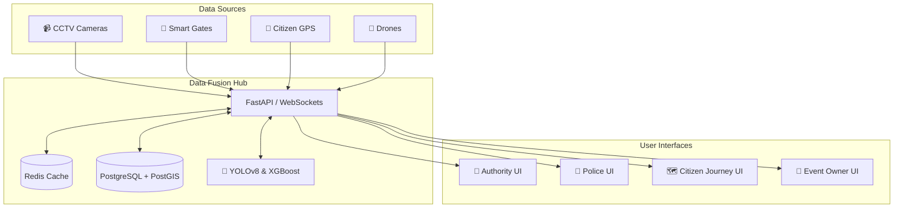

<div align="center">
  
# 🛡️ CrowdShield

**AI-Powered Multi-Source Early Warning & Decision Support System for Large Public Events**

*TechNova Challenge 2026 — Problem Statement 1 Solution*

[](#)
[](#)
[](#)

</div>

---

## 🌟 What is CrowdShield?

**CrowdShield** is an AI-powered event crowd-safety platform designed to detect dangerous conditions **before they escalate into crowd crushes or stampedes**, providing actionable, real-time recommendations to authorities and event organizers.

Instead of monitoring a single CCTV feed, CrowdShield combines **multiple independent data sources** (CCTV, Smart Gates, GPS, Drone, BLE, Telecom) into a unified **Crowd Data Fusion Hub**.

> **Configure the event first. Sense the crowd from multiple sources. Fuse the observations. Understand the crowd state. Predict risk. Recommend preventive action. Let authorized humans act. Measure the result.**

---

## 🚀 Core Features & Innovations

- 🌐 **Multi-Source Data Fusion Hub:** Combines CCTV, Smart Gates, Citizen GPS, Drone, and more. Fault-tolerant architecture ensures the system continues operating even if a single sensor fails.
- 📐 **Standard Observation Format:** Uniform data formatting across all sources for seamless integration.
- 🧠 **AI Predictive Risk Engine:** XGBoost model forecasts crush likelihood in 5, 10, and 15-minute future windows with explainable recommendations.
- 📱 **Unified PWA with RBAC:** One application, four distinct experiences (Authority, Police, Citizen, Event Owner) secured via JWT-based role routing.
- 📍 **Event-First Architecture:** Complete event lifecycle management (Draft → Configuration → Ready → Live → Completed).
- 🚪 **Smart Gate System:** Hardware-agnostic gate counting with real-time status monitoring.
- 🗺️ **Citizen Journey Navigation:** Google Maps-style safe routing adapting to real-time crowd conditions, group sizes, and special needs.
- 👥 **Group-Aware Routing:** Modified Dijkstra algorithm with crowd weights. Routes adapt for solo travelers, couples, families, and special needs.

---

## 🏗️ System Architecture



---

## ⚙️ Quick Start

CrowdShield is built as a modern monorepo. Follow these steps to spin up the local environment.

### 1️⃣ Start the FastAPI Backend
```bash
cd apps/api
python -m venv venv
source venv/bin/activate  # On Windows: venv\Scripts\activate
pip install -r requirements.txt
uvicorn main:app --reload --port 8000
```

### 2️⃣ Start the Next.js PWA
```bash
cd apps/web
npm install
npm run dev
```

### 3️⃣ Open the Platform
Navigate to **`http://localhost:3000`** in your browser.

---

## 📚 Documentation Suite

All structural and architectural details are strictly governed by our `docs/` suite.

| Seq | Document | Target Audience | Key Highlights |
| :---: | :--- | :--- | :--- |
| **01** | **[PRD](./docs/01_PRD.md)** | Product Evaluators | Problem statement, 4 personas, event lifecycle. |
| **02** | **[TRD](./docs/02_TRD.md)** | System Architects | Tech stack, data sources, Fusion Hub, sensor fusion. |
| **03** | **[HLD](./docs/03_HLD.md)** | Solution Designers | Architecture diagram, 25+ modules, data pipeline. |
| **04** | **[LLD](./docs/04_LLD.md)** | Algorithm Specialists | Smart Gate system, GPS route recording, XGBoost features. |
| **05** | **[DFD](./docs/05_DFD.md)** | Data Architects | Multi-source data flow, Level 0/1/2 diagrams, fusion pipeline. |
| **06** | **[UI Specs](./docs/06_UI_WIRE_FRAMES.md)** | UX/UI Designers | Map-centric design, 4 role dashboards, Venue builder. |
| **07** | **[Deployment](./docs/07_DEPLOYMENT_AND_OPS.md)** | DevOps | Infrastructure, multi-source resilience, offline PWA. |
| **08** | **[API Schema](./docs/08_API_AND_EVENTS_SCHEMA.md)** | Integration Engineers | Standard Observation, Crowd State, WebSocket events. |
| **09** | **[Testing](./docs/09_TESTING_AND_QA_STRATEGY.md)** | QA Engineers | Pytest, Playwright, ML eval, multi-source testing. |
| **10** | **[AI Agent Rules](./docs/10_AI_AGENT_INSTRUCTIONS.md)** | AI Assistants | Monorepo boundaries, event-first rules, adapter pattern. |
| **11** | **[Domain Model](./docs/11_DOMAIN_MODEL.md)** | Database Designers | Domain entities, Event map layers, zones, custom routes. |
| **12** | **[Project Structure](./docs/12_PROJECT_STRUCTURE.md)** | Core Engineers | Complete backend feature breakdown, directory structures. |
| **13** | **[Master TODO](./docs/13_MASTER_TODO.md)** | Project Managers | Full phase-by-phase hackathon progression and checklist. |

---

## 📂 Repository Architecture

```text
crowdshield/
├── apps/
│   ├── web/                 # Next.js PWA (Frontend UI & Role Routing)
│   └── api/                 # FastAPI (Backend, WebSockets, DB interaction)
├── ai/                      # AI/ML Pipeline (OpenCV, YOLOv8, XGBoost)
├── data/
│   ├── raw/                 # Input video/datasets
│   └── processed/           # Feature stores
├── simulation/
│   └── digital-twin/        # Scenario generation for testing
├── docs/                    # Technical documentation
└── README.md                # Project overview (This File)
```

---

## 📊 Data Sources & Build Phases

### Multi-Sensor Strategy
| Category | Sources | MVP Status |
| :--- | :--- | :--- |
| **Core** | CCTV, Smart Gates, Citizen GPS | Real |
| **Advanced** | Drone, BLE, Telecom | Simulated |
| **Development** | Synthetic, Historical, Replay | Always Available |

### Development Timeline
| Phase | Name | Scope |
| :---: | :--- | :--- |
| **1** | Foundation | Auth, RBAC, Database, Event Management, PWA |
| **2** | Event Map | Map builder, zones, gates, routes, GPS recording |
| **3** | Data Hub | Source registry, observation model, fusion |
| **4** | Real Data | CCTV, Smart Gate, GPS adapters |
| **5** | AI | Analytics, risk model, prediction |
| **6** | Decision | Recommendations, deployment, announcements |
| **7** | UX | Authority, Police, Event Owner, Citizen Navigation |
| **8** | Simulation | Digital Twin, scenario simulation |
| **9** | Production | Security, testing, monitoring, deployment |

---

<div align="center">
  <i>Designed and engineered for maximum public safety during the TechNova Challenge 2026.</i>
</div>
