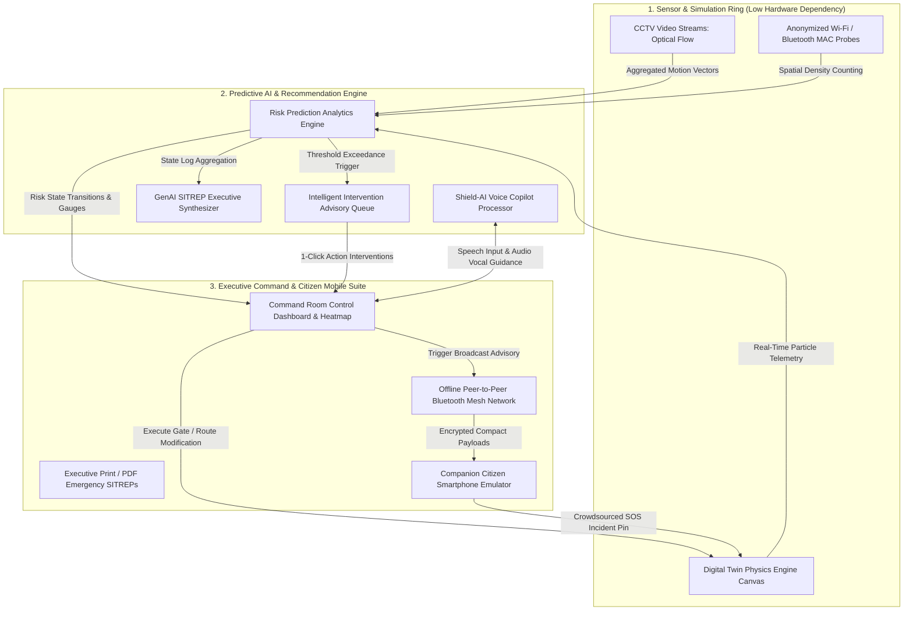

# High-Level Design Document (HLD)
**Project Name:** CrowdShield: AI-Powered Early Warning System for Preventing Crowd Stampedes  
**Document Type:** System Architecture & High-Level Design Specification  
**Document Version:** 1.0 (Production Release)  

---

## 1. System Architectural Overview
CrowdShield is architected as an interconnected, event-driven reactive platform. It decouples complex physical crowd dynamics modeling from user presentation by segmenting the application into three decoupled operational rings:
1. **The Sensor & Simulation Ring:** Ingests external state metrics (simulated via `DigitalTwinEngine` or edge optical-flow/wireless probe cameras).
2. **The Predictive AI & Decision Ring:** Analyzes spatial anomalies, predicts stampede likelihood windows, and composes real-time interactive advisories.
3. **The Executive & Citizen Presentation Ring:** Renders the control room analytical viewports, voice copilot interface, and multilingual companion smartphone application.

---

## 2. Component Architecture Diagram
The following diagram illustrates the structural boundaries and data exchange pathways across the platform modules:

---

## 3. Core System Components & Responsibilities

| Component Name | Primary Source File | Core Responsibility & Architectural Role |
| :--- | :--- | :--- |
| **Platform Orchestrator** | [main.js](file:///C:/Users/ankit/OneDrive/Documents/GitHub/crowdcatchup/src/main.js) | Serves as the central application dependency injection bus and lifecycle coordinator. Synchronizes event callbacks between AI engines, Canvas simulation loops, and UI DOM listeners. |
| **Digital Twin Engine** | [digitalTwinEngine.js](file:///C:/Users/ankit/OneDrive/Documents/GitHub/crowdcatchup/src/simulation/digitalTwinEngine.js) | Evaluates particle vector mechanics across structural venue topologies ([venuePresets.js](file:///C:/Users/ankit/OneDrive/Documents/GitHub/crowdcatchup/src/simulation/venuePresets.js)). Computes dynamic spatial density grids and renders visual heatmaps via 2D Canvas rendering context. |
| **Risk Prediction Engine** | [riskPredictionEngine.js](file:///C:/Users/ankit/OneDrive/Documents/GitHub/crowdcatchup/src/ai/riskPredictionEngine.js) | Monitors real-time telemetry frames. Calculates stampede probability %, peak density progress bars, movement velocity dropoff, and manages alert status state transitions (`SAFE` / `WARNING` / `DANGER`). |
| **Recommendation System** | [recommendationSystem.js](file:///C:/Users/ankit/OneDrive/Documents/GitHub/crowdcatchup/src/ai/recommendationSystem.js) | Rule-driven advisory decision support. Synthesizes actionable 1-click countermeasures (gate adjustments, Rapid Action Force deployments) that bridge executive controls directly to live simulation states. |
| **Voice Assistant** | [voiceAssistant.js](file:///C:/Users/ankit/OneDrive/Documents/GitHub/crowdcatchup/src/modules/voiceAssistant.js) | Integrates Web Speech Recognition API and vocal synthesis to provide hands-free conversational inquiry ("What is Gate 2 density?") and vocal audio navigational feedback. |
| **GenAI SITREP Engine** | [genAiSummary.js](file:///C:/Users/ankit/OneDrive/Documents/GitHub/crowdcatchup/src/modules/genAiSummary.js) | Generative briefing document producer that composes executive-level emergency situation reports (SITREPs) with risk analysis and mitigation audits ready for official government distribution. |
| **Mobile App Controller** | [mobileAppController.js](file:///C:/Users/ankit/OneDrive/Documents/GitHub/crowdcatchup/src/modules/mobileAppController.js) | Controls the companion smartphone simulator. Manages real-time translation dictionaries ([translations.js](file:///C:/Users/ankit/OneDrive/Documents/GitHub/crowdcatchup/src/data/translations.js)) across English, Hindi, Marathi, and Tamil, handles SOS reporting, and visualizes safe exit routes. |

---

## 4. End-to-End Operational Workflow Topology

The system operates across a closed-loop feedback lifecycle:
1. **State Ingestion & Monitoring:** The venue simulation or optical sensor suite evaluates pedestrian movement patterns across selected topological maps (e.g., Maha Kumbh Mela Ghats or Metro Sports Stadiums).
2. **Anomaly & Bottleneck Discovery:** If an obstruction occurs (such as a blocked exit or rain shelter surge), [riskPredictionEngine.js](file:///C:/Users/ankit/OneDrive/Documents/GitHub/crowdcatchup/src/ai/riskPredictionEngine.js) detects local velocity dropoff below $0.5\text{ m/s}$ and escalates system status from `SAFE` to `CRITICAL DANGER`.
3. **Advisory Synthesis:** The alarm state triggers [recommendationSystem.js](file:///C:/Users/ankit/OneDrive/Documents/GitHub/crowdcatchup/src/ai/recommendationSystem.js), presenting priority action cards to Command Room executives.
4. **Execution & Closed-Loop Mitigation:** When an authority approves an intervention (e.g., *Open Emergency Gate 4 & Divert Flow*):
   * A structural transition command executes in [digitalTwinEngine.js](file:///C:/Users/ankit/OneDrive/Documents/GitHub/crowdcatchup/src/simulation/digitalTwinEngine.js), opening barriers and redistributing congested particle flow vectors toward clear escape ramps.
   * An instant multilingual emergency payload transmits via mesh network simulation to [mobileAppController.js](file:///C:/Users/ankit/OneDrive/Documents/GitHub/crowdcatchup/src/modules/mobileAppController.js), guiding citizens safely via regional text banners and audio cues.
   * The localized density subsides within minutes, returning telemetry meters back to nominal safe baseline parameters.
