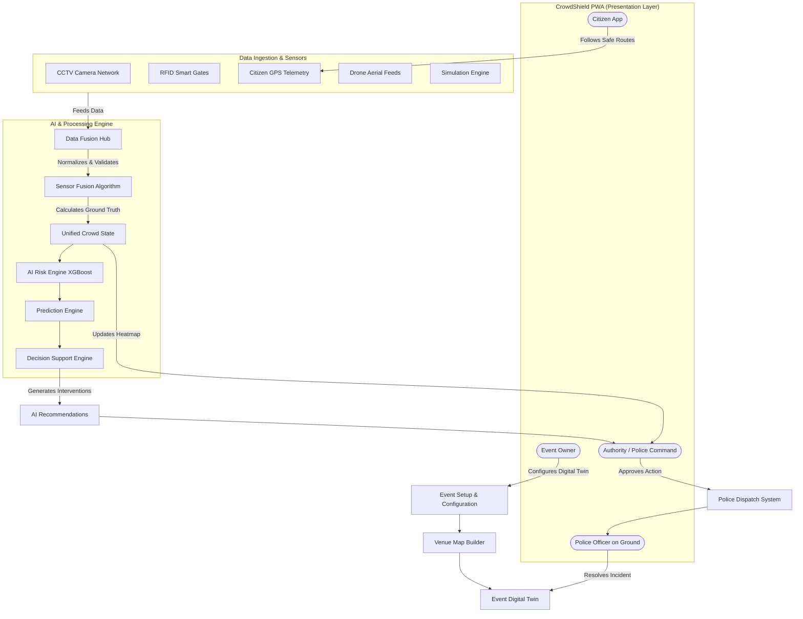

# High-Level Design Document (HLD)
**Project Name:** CrowdShield: AI-Powered Multi-Source Early Warning and Decision Support System for Large Public Events
**Document Version:** 3.0 (Multi-Source Data Fusion Architecture Release)

> **Authoritative Source:** For the complete 63-section system specification, see [`00_MASTER_SPEC.md`](./00_MASTER_SPEC.md).

---

## 1. System Architectural Overview

CrowdShield is architected as an interconnected, event-driven reactive platform. It centralizes multi-source data ingestion through a **Crowd Data Fusion Hub**, scales AI processing on the backend, and distributes actionable intelligence to four distinct user roles via a unified Progressive Web App (PWA).

The core principle:

> **Configure the event first. Sense the crowd from multiple sources. Fuse the observations. Understand the crowd state. Predict risk. Recommend preventive action. Let authorized humans act. Measure the result.**

### 1.1 Three-Layer Architecture
1. **The Ingestion & AI Layer:** Processes CCTV, Smart Gates, GPS, Drone, BLE, Telecom, and Synthetic data through the Data Fusion Hub and AI pipeline.
2. **The API & Services Layer (FastAPI):** Manages routing, RBAC, WebSockets, and database persistence.
3. **The Presentation Layer (Next.js PWA):** Renders the central interactive map and role-specific dashboards.

---

## 2. Component Architecture Diagram



---

## 3. The 25+ Backend Modules

| Module | Core Responsibility |
| :--- | :--- |
| **auth** | Authentication, JWT, session management |
| **users** | User profiles, role assignment |

| **events** | Event lifecycle (8 statuses), event CRUD |
| **venues** | Venue geometry, boundaries |
| **zones** | Zone builder, capacity, thresholds |
| **gates** | Gate configuration, Gate-Zone-Route relationships |
| **routes** | Custom routes (one-way, emergency, police, temporary) |
| **sensors** | Sensor/camera registration, source registry |
| **data_ingestion** | Multi-source adapter framework |
| **data_normalization** | Standard Observation Format conversion |
| **data_validation** | Schema + range validation |
| **source_health** | ONLINE/DELAYED/OFFLINE monitoring per source |
| **sensor_fusion** | Confidence-weighted fusion, disagreement detection |
| **crowd_state** | Unified per-zone crowd state generation |
| **analytics** | Density, speed, flow, queue, occupancy calculations |
| **risk_engine** | XGBoost risk prediction (5/10/15 min horizons) |
| **recommendations** | Decision engine, intervention proposals with explanations |
| **incidents** | Incident creation, tracking, resolution |
| **alerts** | Alert generation and distribution |
| **notifications** | Push notifications, multilingual broadcasts |
| **police** | Task assignment, deployment tracking |
| **simulation** | Pre-event scenario simulation, Digital Twin |
| **digital_twin** | Event digital representation |
| **reports** | Post-event analytics, historical reports |
| **navigation** | Citizen safe-route calculation (A*), group routing |
| **contact** | External communication and CRM integrations |


---

## 4. End-to-End Operational Workflow (The Core Loop)

1. **CONFIGURE:** Event Owner creates event, defines venue, zones, gates, routes, cameras, Smart Gates.
2. **SENSE:** CCTV, Smart Gates, GPS, and other sources continuously send observations.
3. **NORMALIZE:** All sources converted to Standard Observation Format.
4. **FUSE:** Fusion Hub combines overlapping observations, calculates confidence-weighted crowd state.
5. **UNDERSTAND:** Analytics Engine calculates density, speed, flow conflicts per zone.
6. **PREDICT:** Risk Engine forecasts crush likelihood in 5/10/15-minute windows.
7. **RECOMMEND:** Decision Engine proposes concrete interventions with explanations.
8. **APPROVE:** Authority reviews and clicks APPROVE on intervention plan.
9. **ACT:** Police receive tasks. Citizens receive safe-route alerts.
10. **VERIFY:** System continues processing. Risk downgrades when conditions improve.

---

## 5. Event-First Data Model

Every data point belongs to an event. The hierarchy is:

```
EVENT → VENUE → ZONE/GATE/ROUTE → SOURCE → OBSERVATION
```

This is a fundamental data-integrity rule. Never mix Event A with Event B.

---

## 6. Source Adapter Pattern

Each data source connects through a standardized adapter:

```text
REAL SOURCE → ADAPTER → STANDARD OBSERVATION FORMAT → FUSION HUB
SIMULATED SOURCE → ADAPTER → STANDARD OBSERVATION FORMAT → FUSION HUB
```

Real and simulated sources must produce identical output formats. Never pretend a simulator is a real connection.

---

## 7. Source Health & Confidence

| Source Health | Confidence Impact |
| :--- | :--- |
| ONLINE | Full confidence weight |
| DELAYED | Reduced confidence weight |
| OFFLINE | Minimal confidence weight, fallback to other sources |

Confidence considers: accuracy, freshness, latency, historical reliability, coverage, sensor health, data completeness.

---

## 8. Hackathon MVP Scope

### Real Implementation
* PWA, Authentication, Event creation, Event map, Zones, Routes
* Smart Gate simulation, CCTV/video processing, Citizen GPS
* Real-time dashboard, Crowd heatmap, Risk prediction, Recommendations
* Role-based interfaces (Authority, Police, Event Owner, Citizen)

### Simulated (architecture ready for real later)
* Telecom, Drone, BLE, Wearables

### Demo Story
Normal state -> Gate G3 high inflow -> Zone B density rising -> Fusion detects change -> Risk CRITICAL -> AI recommends intervention -> Authority approves -> Risk falls -> Incident prevented.


---

## 6. EVENT-FIRST ARCHITECTURE

CrowdShield begins with an event.

The lifecycle is:

CREATE EVENT
→ DEFINE VENUE
→ DEFINE EVENT AREA
→ CREATE ZONES
→ CREATE ENTRY/EXIT POINTS
→ CONFIGURE SMART GATES
→ CREATE ROUTES
→ CREATE EMERGENCY ROUTES
→ ADD CAMERAS
→ ADD OTHER DATA SOURCES
→ CONFIGURE CAPACITIES
→ VALIDATE VENUE
→ RUN SIMULATION
→ PUBLISH EVENT
→ LIVE MONITORING
→ RISK PREDICTION
→ INTERVENTION
→ POST-EVENT ANALYTICS

Every data point must belong to an event.

---

## 53. TECHNICAL ARCHITECTURE

Recommended initial stack:

## Frontend

* Next.js
* React
* TypeScript
* Tailwind CSS
* PWA support
* Custom SVG Digital Twin mapping architecture (offline-capable)
* Recharts/ECharts for analytics

## Backend

* Python
* FastAPI
* Pydantic
* SQLAlchemy
* PostgreSQL
* PostGIS
* Redis

## AI/ML

* Python
* PyTorch
* OpenCV
* YOLOv8 (Nano) detector
* Tracking algorithm
* scikit-learn where appropriate

## Real-time

* WebSockets
* Redis Pub/Sub or Redis Streams initially

Future scalability:

* Kafka
* Dedicated stream processing

## Storage

* PostgreSQL/PostGIS
* Object storage for video/images
* Redis for live state/cache

## Deployment

Design for:

* Docker
* AWS
* Managed PostgreSQL
* Object storage
* Redis
* Container deployment
* Monitoring

Do not over-engineer the MVP with unnecessary microservices.

Start modular monolith + clearly separated services/modules.

---

## 63. CITIZEN NAVIGATION MODULE

### New Module: `features/navigation/`

```text
features/navigation/
├── domain/
│   ├── entities/
│   │   ├── group.py           # Group profile (size, special needs)
│   │   ├── journey.py         # User journey (source → destination)
│   │   └── safe_route.py      # Computed safe route with crowd weights
│   ├── interfaces/
│   │   └── i_route_engine.py  # Route calculation interface
│   └── enums/
│       ├── transport_mode.py  # DRIVE, WALK, TRANSIT
│       └── group_profile.py   # SOLO, COUPLE, FAMILY, GROUP, LARGE_GROUP
├── application/
│   ├── use_cases/
│   │   ├── plan_group_journey.py   # Compute best route for group
│   │   ├── navigate.py             # Turn-by-turn with crowd data
│   │   └── check_reroute.py        # Reroute on congestion
│   └── services/
│       └── navigation_service.py   # Integrates with crowd state
├── infrastructure/
│   ├── engines/
│   │   ├── route_engine.py         # A* (A-Star) Algorithm with crowd weights
│   │   └── navigation_engine.py    # Turn-by-turn generation
│   └── adapters/
│       └── osm_adapter.py          # OpenStreetMap road network
└── api/
    ├── routes.py                   # POST /navigation/plan, WS /navigation/live
    └── schemas.py
```

### Frontend Module: `features/citizen-navigation/`

```text
apps/web/src/features/citizen-navigation/
├── components/
│   ├── JourneyPlanner.tsx          # Source → Destination input
│   ├── GroupSizeSelector.tsx       # +/- buttons, special needs
│   ├── RouteMap.tsx                # Map with route overlay
│   ├── NavigationPanel.tsx         # Turn-by-turn directions
│   ├── CrowdOverlay.tsx            # Real-time crowd density on route
│   ├── GateRecommendation.tsx      # "Use Gate G5 — Low queue"
│   ├── GroupTipCard.tsx            # Family-specific tips
│   └── ExitPlanner.tsx             # Best exit + route home
├── hooks/
│   ├── useJourney.ts
│   ├── useNavigation.ts
│   ├── useLiveReroute.ts
│   └── useGroupCoordination.ts
└── api/
    └── navigation-client.ts
```
                                    AI RISK ENGINE
                                            ↓
                                  PREDICTION ENGINE
                                            ↓
                                    DECISION ENGINE
                                            ↓
                                   RECOMMENDATIONS
                                            ↓
                               AUTHORITY / POLICE ACTION
                                            ↓
                                      CROWD RESPONSE
                                            ↓
                                      FEEDBACK LOOP
```

---

