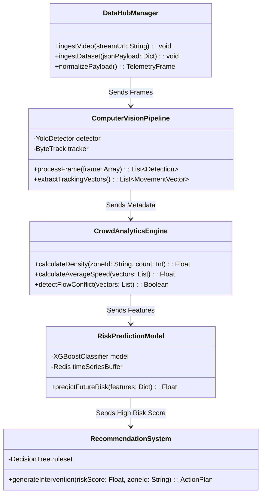
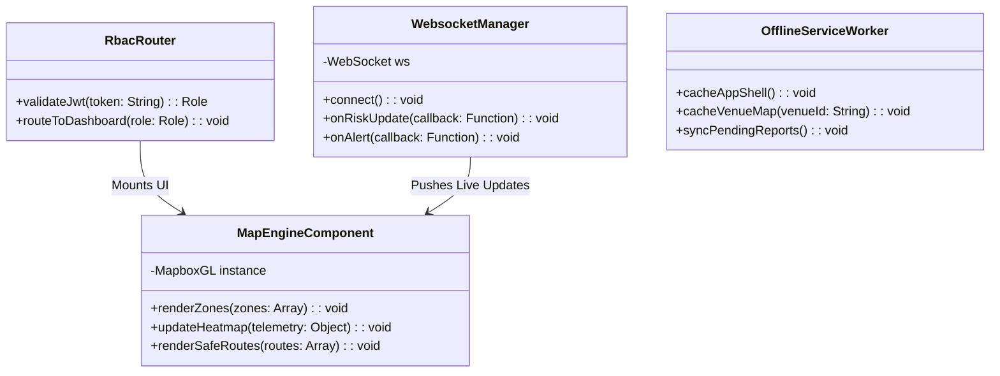

# Low-Level Design Document (LLD)
**Project Name:** CrowdShield: AI-Powered Early Warning System for Preventing Crowd Stampedes  
**Document Type:** Low-Level Class Specifications, APIs & Algorithmic Logic  
**Document Version:** 2.0 (Monorepo/PWA Architecture Release)  

---

## 1. Subsystem Class Diagrams & Logic Flow

The CrowdShield codebase is divided into Python (FastAPI/AI) and TypeScript (Next.js) environments.

### 1.1 Python AI & Backend Services
The Python backend processes heavy AI tasks asynchronously.



### 1.2 TypeScript Next.js Frontend (PWA)
The frontend relies heavily on modular React components and state management (Zustand/Redux).



---

## 2. Deep Algorithmic Implementations

### 2.1 Computer Vision Object Tracking (Python)
Instead of relying on basic motion detection, CrowdShield extracts definitive identity tracks to calculate actual crowd velocity:

```python
# Pseudocode Logic for AI tracking pipeline
def process_video_stream(frame):
    # 1. Detect humans
    detections = yolo_detector.detect(frame, classes=['person'])
    
    # 2. Maintain ID tracks across frames
    tracks = byte_tracker.update(detections)
    
    metadata = []
    for track in tracks:
        # Calculate speed (pixels/sec -> meters/sec approximation)
        speed = calculate_speed(track.history[-5], track.current_pos)
        direction = calculate_vector_angle(track.history[-5], track.current_pos)
        
        metadata.append({
            "id": track.track_id,
            "x": track.current_pos.x,
            "y": track.current_pos.y,
            "speed": speed,
            "direction": direction
        })
        
    return metadata
```

### 2.2 Time-Series Risk Prediction (XGBoost)
Because stampedes don't happen instantly, the ML model requires historical context to predict the future.

```python
def extract_time_series_features(zone_id):
    # Fetch historical windows from Redis
    current = redis.get(f"{zone_id}:current")
    t_minus_1 = redis.get(f"{zone_id}:t-1min")
    t_minus_5 = redis.get(f"{zone_id}:t-5min")
    
    density_growth_rate = (current.density - t_minus_5.density) / 5.0
    speed_decline_rate = (current.speed - t_minus_1.speed)
    
    return [
        current.density, 
        density_growth_rate, 
        current.speed, 
        speed_decline_rate,
        current.entry_rate - current.exit_rate # Bottleneck metric
    ]
```

---

## 3. System Safety State Machine
The core application state rotates through operational phases managed by the Risk Prediction Engine:


---

## 4. Multilingual PWA Alerts
When an intervention is approved, the PWA utilizes standard web internationalization (`i18next`) to render alerts based on the Citizen's device language, ensuring immediate comprehension. Offline caching ensures the translation dictionaries are available without internet.
