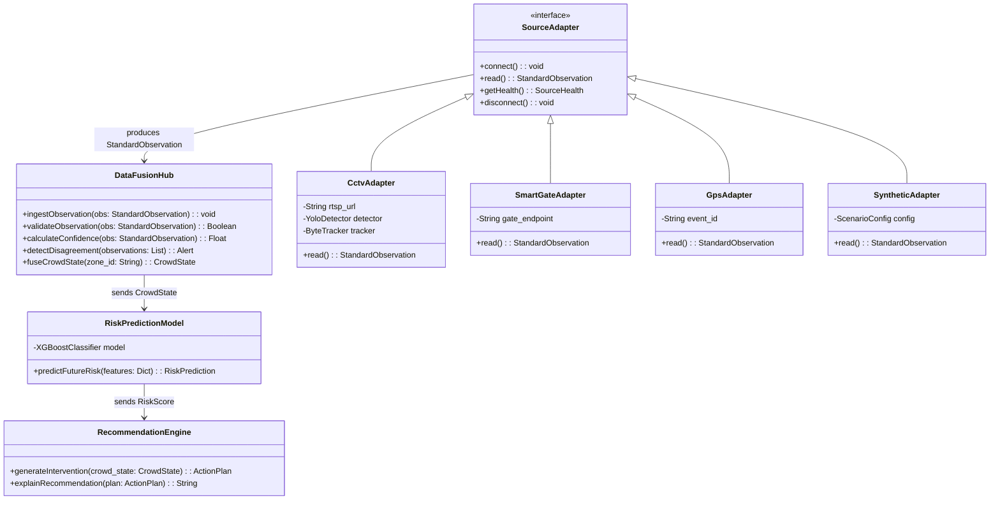
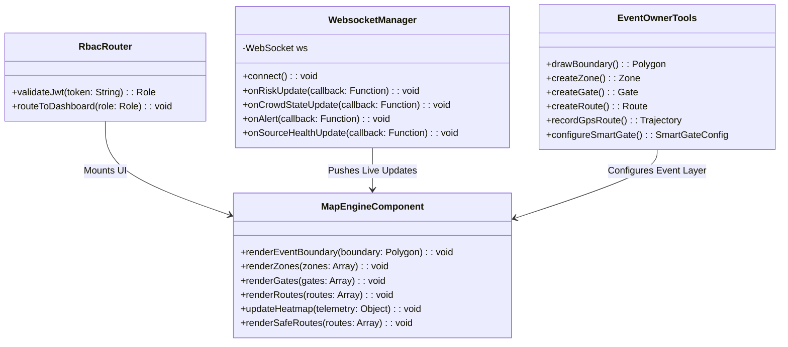
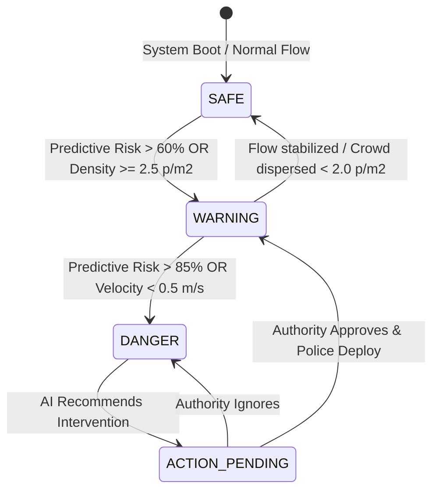

# Low-Level Design Document (LLD)
**Project Name:** CrowdShield: AI-Powered Multi-Source Early Warning and Decision Support System for Large Public Events
**Document Version:** 3.0 (Multi-Source Data Fusion Architecture Release)

> **Authoritative Source:** For the complete 63-section system specification, see [`00_MASTER_SPEC.md`](./00_MASTER_SPEC.md).

---

## 1. Subsystem Class Diagrams & Logic Flow

### 1.1 Python AI & Backend Services



### 1.2 TypeScript Next.js Frontend



---

## 2. Smart Gate System (Low-Level)

### 2.1 Smart Gate Data Model

```python
class SmartGateConfig:
    gate_id: str
    event_id: str
    zone_id: str
    gate_type: str  # "ENTRY" | "EXIT" | "BIDIRECTIONAL"
    technology: str  # "AI_CAMERA" | "IR" | "LIDAR" | "TURNSTILE" | "RFID" | "QR"
    max_capacity_per_minute: int
    connected_routes: list[str]
    location: GeoPoint

class SmartGateObservation:
    gate_id: str
    event_id: str
    zone_id: str
    timestamp: datetime
    entry_count: int
    exit_count: int
    flow_rate: float  # people per minute
    queue_estimate: int
    status: str  # NORMAL | HIGH_FLOW | CONGESTED | CRITICAL | CLOSED | EMERGENCY_ONLY | OFFLINE
    confidence: float
    device_health: str
```

### 2.2 Gate Status Thresholds

| Status | Condition |
| :--- | :--- |
| NORMAL | flow_rate < 80% of max_capacity |
| HIGH_FLOW | flow_rate 80-95% of max_capacity |
| CONGESTED | flow_rate 95-100% of max_capacity |
| CRITICAL | flow_rate > max_capacity OR safety threshold breached |
| CLOSED | gate manually disabled |
| EMERGENCY_ONLY | gate reserved for emergency evacuation |
| OFFLINE | device not responding |

---

## 3. GPS Route Recording (Low-Level)

### 3.1 GPS Trajectory Processing

```python
class GpsRouteRecorder:
    def start_recording(self, event_owner_id: str) -> str:
        """Start collecting GPS points."""
        
    def add_point(self, lat: float, lng: float, timestamp: datetime) -> None:
        """Add a GPS point to the trajectory."""
        
    def stop_recording(self) -> RawTrajectory:
        """Stop and return raw trajectory."""
        
    def process_trajectory(self, raw: RawTrajectory) -> Route:
        """Smooth, map-match, and generate editable route."""
        # 1. Remove outliers (GPS jitter)
        # 2. Smooth trajectory (moving average)
        # 3. Map-match to venue geometry
        # 4. Generate route with waypoints
        # 5. Return editable route
```

### 3.2 GPS Accuracy Handling

Do not assume GPS is perfectly accurate. The system must:
- Filter outliers (points far from trajectory)
- Smooth jitter (moving average)
- snap to known paths where possible
- Allow manual editing after recording

---

## 4. Temporary Event Infrastructure (Low-Level)

```python
class TemporaryInfrastructure:
    id: str
    type: str  # GATE | ROAD | ROUTE | BARRICADE | EXIT | POLICE_POST | MEDICAL_CAMP | RESTRICTED_AREA
    event_id: str
    zone_id: str | None
    start_time: datetime
    end_time: datetime | None
    status: str  # PLANNED | ACTIVE | CLOSED
    capacity: int | None
    location: GeoPoint | Polygon
    owner_id: str
    notes: str | None
```

---

## 5. Gate-Zone-Route Relationships (Low-Level)

```python
class GateZoneRoute:
    gate_id: str
    zone_ids: list[str]  # one or more zones
    route_ids: list[str]  # one or more routes
    direction: str  # "ENTRY" | "EXIT" | "BIDIRECTIONAL"
    configured_capacity: int  # people per minute
    
    def predict_downstream_impact(self, incoming_flow: float) -> ZoneImpact:
        """Predict how incoming flow affects connected zones."""
```

---

## 6. Time-Series Risk Prediction (XGBoost)

```python
def extract_time_series_features(zone_id: str) -> list:
    current = get_current_crowd_state(zone_id)
    t_minus_1 = get_historical(zone_id, minutes=1)
    t_minus_5 = get_historical(zone_id, minutes=5)
    
    density_growth_rate = (current.density - t_minus_5.density) / 5.0
    speed_decline_rate = current.speed - t_minus_1.speed
    entry_exit_imbalance = current.entry_rate - current.exit_rate
    
    return [
        current.density,
        density_growth_rate,
        current.average_speed,
        speed_decline_rate,
        entry_exit_imbalance,
        current.bottleneck_score,
        current.confidence
    ]
```

---

## 7. Sensor Fusion (Low-Level)

### 7.1 Confidence-Weighted Estimation

```python
def fuse_crowd_state(observations: list[StandardObservation]) -> CrowdState:
    """Fuse multiple source observations into unified crowd state."""
    weighted_sum = 0
    total_weight = 0
    
    for obs in observations:
        weight = obs.confidence * get_source_reliability(obs.source_id)
        weighted_sum += obs.value * weight
        total_weight += weight
    
    estimated_value = weighted_sum / total_weight if total_weight > 0 else 0
    return estimated_value
```

### 7.2 Disagreement Detection

```python
def detect_disagreement(observations: list[StandardObservation]) -> list[Alert]:
    """Detect when sources significantly disagree."""
    values = [obs.value for obs in observations]
    median = statistics.median(values)
    alerts = []
    
    for obs in observations:
        deviation = abs(obs.value - median) / median
        if deviation > 0.3:  # 30% deviation threshold
            alerts.append(Alert(
                type="SENSOR_DISAGREEMENT",
                source_id=obs.source_id,
                message=f"Possible {obs.source_id} anomaly: {obs.value} vs median {median}"
            ))
    return alerts
```

---

## 8. Recommendation Explanation (Low-Level)

Every AI recommendation must include an explanation:

```python
class ActionPlan:
    recommendation_id: str
    zone_id: str
    risk_score: float
    actions: list[Action]
    explanation: Explanation
    confidence: float

class Explanation:
    primary_reason: str
    supporting_factors: list[str]
    source_agreement: float  # how much sources agree
    prediction_confidence: float
    
    # Example:
    # primary_reason: "Zone B density increased 24% in 4 minutes"
    # supporting_factors: [
    #   "Entry rate exceeds configured threshold",
    #   "Exit rate is declining",
    #   "Route R4 is approaching capacity",
    #   "Independent sources agree with high confidence"
    # ]
```

---

## 9. System Safety State Machine



---

## 10. Multilingual PWA Alerts

When an intervention is approved, the PWA utilizes `i18next` to render alerts based on the Citizen device language. Supported: English, Hindi, Odia, additional Indian languages later.

Safety-critical messages use controlled templates. AI may draft announcements, but human approval is required for critical broadcasts.


---

## 32. CROWD STATE

The Fusion Hub should produce one unified crowd state.

Example:

```json
{
  "event_id": "EVT-001",
  "zone_id": "ZONE-B",
  "estimated_people": 1280,
  "density_level": "HIGH",
  "average_speed": 0.34,
  "flow_direction": "NORTH",
  "entry_rate": 165,
  "exit_rate": 52,
  "bottleneck_score": 0.87,
  "risk_score": 86,
  "risk_level": "CRITICAL",
  "confidence": 0.89
}
```

The rest of the platform should primarily consume this Crowd State instead of directly depending on individual sensor formats.

---

## 33. CROWD ANALYTICS

The system must estimate:

* Crowd density
* Crowd size
* Average speed
* Flow direction
* Entry rate
* Exit rate
* Queue length
* Zone occupancy
* Route utilization
* Gate utilization
* Bottlenecks
* Reverse flow
* Flow conflict
* Sudden surge
* Abnormal movement

---

## 34. RISK ENGINE

Risk prediction should consider:

* Density
* Density growth rate
* Crowd speed
* Speed reduction
* Entry/exit imbalance
* Gate flow
* Zone capacity
* Route capacity
* Bottleneck score
* Direction conflicts
* Reverse movement
* Sudden surge
* Route blockage
* Historical patterns
* Weather/environmental signals where available
* Sensor confidence

The system should produce:

Current risk
and
Predicted future risk.

---

## 35. PREDICTION HORIZON

The system should aim to predict:

* Next few minutes
* Approximately 5 minutes
* Approximately 10 minutes
* Approximately 15 minutes

The exact prediction horizon must be configurable and evaluated using actual model performance.

Never claim guaranteed prediction.

Use probabilistic risk.

---

## 36. RISK LEVELS

Use:

🟢 LOW
🟡 MODERATE
🟠 HIGH
🔴 CRITICAL

Risk should be zone-specific.

Example:

ZONE-A → LOW
ZONE-B → CRITICAL
ZONE-C → HIGH
ZONE-D → LOW

---

## 37. DECISION ENGINE

The system must not stop at:

"Risk = 85."

It must translate risk into possible interventions.

Examples:

* Open alternate gate
* Restrict entry gate
* Redirect incoming crowd
* Activate one-way flow
* Close route
* Open emergency route
* Deploy police
* Move security personnel
* Change barricade configuration
* Broadcast announcement
* Send citizen alert
* Recommend medical deployment

---

## 39. RECOMMENDATION EXPLANATION

Every AI recommendation must explain why.

Example:

**Recommendation: Restrict Gate G3**

Reason:

* Zone B density increased 24% in 4 minutes
* Entry rate exceeds configured threshold
* Exit rate is declining
* Route R4 is approaching capacity
* Independent sources agree with high confidence

This makes the AI explainable.

---

## 64. CITIZEN JOURNEY PLANNER (Low-Level)

### Group Entity

```python
class Group:
    id: str
    size: int
    has_children: bool
    has_elderly: bool
    has_mobility_issues: bool
    preferred_time: datetime | None
    members: list[User] | None  # If sharing location
    
    @property
    def profile(self) -> str:
        if self.size == 1: return "SOLO"
        if self.size == 2: return "COUPLE"
        if self.size <= 5: return "FAMILY"
        if self.size <= 15: return "GROUP"
        return "LARGE_GROUP"
    
    @property
    def min_road_width(self) -> float:
        return self.size * 0.5  # 0.5m per person
```

### Journey Entity

```python
class Journey:
    id: str
    user_id: str
    group_id: str | None
    source: GeoPoint
    destination: GeoPoint
    transport_mode: str  # "DRIVE" | "WALK" | "TRANSIT"
    status: str  # "PLANNING" | "NAVIGATING" | "COMPLETED"
    created_at: datetime
    estimated_arrival: datetime | None
```

### SafeRoute Value Object

```python
class SafeRoute:
    waypoints: list[GeoPoint]
    distance: float  # meters
    estimated_time: int  # seconds
    crowd_level: str  # "LOW" | "MODERATE" | "HIGH" | "AVOID"
    safety_score: float  # 0.0 - 1.0
    width_suitable: bool
    recommended_gate: str
    crowd_ahead: list[CrowdSegment]  # Crowd info for each segment
    
@dataclass
class CrowdSegment:
    zone_id: str
    density: float
    status: str  # "CLEAR" | "MODERATE" | "CONGESTED" | "DANGEROUS"
```

### NavigationState Value Object

```python
class NavigationState:
    current_position: GeoPoint
    next_instruction: str
    remaining_distance: float
    remaining_time: int
    crowd_ahead: str  # "CLEAR" | "MODERATE" | "CONGESTED"
    reroute_suggested: bool
    reroute_reason: str | None
    group_members_positions: list[GroupMemberPosition] | None

@dataclass
class GroupMemberPosition:
    user_id: str
    name: str
    position: GeoPoint
    distance_from_user: float
    status: str  # "KEEPING_UP" | "FALLING_BEHIND" | "SEPARATED"
```

### Journey Planner API Endpoints

```python
# POST /api/v1/navigation/plan
class JourneyPlanRequest(BaseModel):
    source_lat: float
    source_lng: float
    dest_lat: float
    dest_lng: float
    group_size: int = 1
    has_children: bool = False
    has_elderly: bool = False
    has_mobility_issues: bool = False
    transport_mode: str = "WALK"
    preferred_time: datetime | None = None

class JourneyPlanResponse(BaseModel):
    routes: list[SafeRoute]
    recommended_route: SafeRoute
    recommended_gate: Gate
    estimated_time: int
    safety_score: float
    group_tips: list[str]
    meeting_points: list[MeetingPoint] | None

# WS /api/v1/navigation/live
# Client sends: { "type": "NAVIGATE", "journey_id": "..." }
# Server sends: { "type": "NAVIGATION_UPDATE", "state": NavigationState }
# Server sends: { "type": "REROUTE_ALERT", "reason": "...", "new_route": SafeRoute }
```

### Route Engine Algorithm (Pseudocode)

```python
def plan_route(source, destination, group, crowd_state, road_network):
    # Build graph with crowd-weighted edges
    graph = build_crowd_weighted_graph(road_network, crowd_state, group)
    
    # Run modified Dijkstra
    shortest_safe_path = dijkstra(graph, source, destination)
    
    # Calculate route metrics
    route = SafeRoute(
        waypoints=shortest_safe_path.waypoints,
        distance=shortest_safe_path.distance,
        estimated_time=calculate_time(shortest_safe_path, group),
        crowd_level=assess_crowd_level(shortest_safe_path, crowd_state),
        safety_score=calculate_safety_score(shortest_safe_path, crowd_state, group),
        width_suitable=all_widths_suitable(shortest_safe_path, group),
        recommended_gate=find_best_gate(shortest_safe_path, group, crowd_state),
        crowd_ahead=get_segment_crowd(shortest_safe_path, crowd_state)
    )
    
    # Generate group-specific tips
    tips = generate_group_tips(route, group)
    
    return JourneyPlanResponse(
        routes=[route],  # Could return multiple alternatives
        recommended_route=route,
        recommended_gate=route.recommended_gate,
        estimated_time=route.estimated_time,
        safety_score=route.safety_score,
        group_tips=tips,
        meeting_points=find_meeting_points(destination, crowd_state)
    )
```

---

