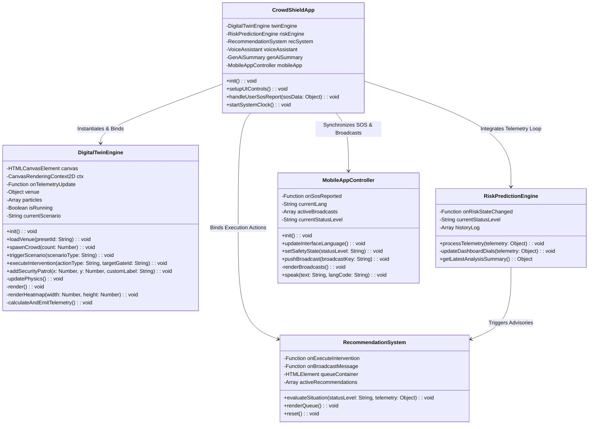
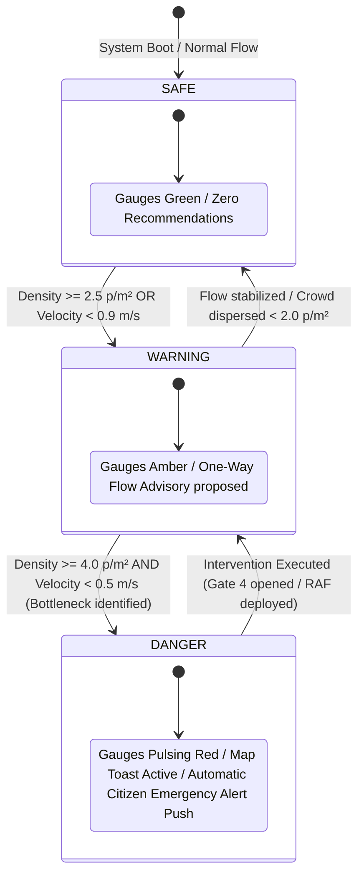

# Low-Level Design Document (LLD)
**Project Name:** CrowdShield: AI-Powered Early Warning System for Preventing Crowd Stampedes  
**Document Type:** Low-Level Class Specifications, APIs & Algorithmic Logic  
**Document Version:** 1.0 (Production Release)  

---

## 1. Class Diagram & Public Module Interfaces
The application codebase in `src/` follows object-oriented ES6 modular encapsulation. Below are the class structural definitions and method contracts for each primary component:



---

## 2. Deep Algorithmic Implementations

### 2.1 Spatial Density Binning & Heatmap Renderer (`renderHeatmap`)
To maintain high performance without GPU shaders, [digitalTwinEngine.js](file:///C:/Users/ankit/OneDrive/Documents/GitHub/crowdcatchup/src/simulation/digitalTwinEngine.js) transforms Cartesian particle coordinates into an integer raster grid before rendering visual radial gradient overlays:

```javascript
// Pseudocode Logic for real-time spatial heatmap calculation
function renderHeatmap(width, height) {
    const gridSize = 40; // 40px square grid blocks
    const cols = Math.ceil(width / gridSize);
    const rows = Math.ceil(height / gridSize);
    const grid = new Array(cols * rows).fill(0);

    // O(N) single-pass density accumulation
    for (let particle of this.particles) {
        let col = Math.floor(particle.x / gridSize);
        let row = Math.floor(particle.y / gridSize);
        if (col >= 0 && col < cols && row >= 0 && row < rows) {
            grid[row * cols + col]++;
        }
    }

    // Color gradient assignment based on local density clustering
    for (let r = 0; r < rows; r++) {
        for (let c = 0; c < cols; c++) {
            let count = grid[r * cols + c];
            if (count < 2) continue; // transparent safe space

            let fillStyle = 'rgba(16, 185, 129, 0.15)'; // Safe Green
            if (count >= 12) fillStyle = 'rgba(239, 68, 68, 0.65)'; // Hazard Red
            else if (count >= 7) fillStyle = 'rgba(245, 158, 11, 0.45)'; // Warning Amber
            else if (count >= 4) fillStyle = 'rgba(234, 179, 8, 0.25)'; // Congestion Yellow

            this.ctx.fillStyle = fillStyle;
            this.ctx.beginPath();
            this.ctx.arc(c * gridSize + gridSize / 2, r * gridSize + gridSize / 2, gridSize * 0.75, 0, 2 * Math.PI);
            this.ctx.fill();
        }
    }
}
```

### 2.2 Multilingual Translation Resolver (`getTranslation`)
Located in [translations.js](file:///C:/Users/ankit/OneDrive/Documents/GitHub/crowdcatchup/src/data/translations.js), this helper dynamically evaluates nested object dot-notation keys across regional dictionaries (`en`, `hi`, `mr`, `ta`) with safe automatic English fallback:

```javascript
export function getTranslation(lang = 'en', keyPath) {
    const keys = keyPath.split('.');
    let current = TRANSLATIONS[lang] || TRANSLATIONS.en;
    for (const k of keys) {
        current = current?.[k];
        if (!current) break;
    }
    // Safe evaluation fallback if key translation missing
    if (!current && lang !== 'en') {
        let fallback = TRANSLATIONS.en;
        for (const k of keys) {
            fallback = fallback?.[k];
            if (!fallback) break;
        }
        return fallback || keyPath;
    }
    return current || keyPath;
}
```

---

## 3. System Safety State Machine
The core application state rotates through three deterministic operational phases managed by [riskPredictionEngine.js](file:///C:/Users/ankit/OneDrive/Documents/GitHub/crowdcatchup/src/ai/riskPredictionEngine.js):



---

## 4. Data Structures & Schema Definitions

### 4.1 Venue Preset Topology Configuration Schema
Defined inside [venuePresets.js](file:///C:/Users/ankit/OneDrive/Documents/GitHub/crowdcatchup/src/simulation/venuePresets.js), controlling physical geometry simulation:
* `id`: String identifier (`kumbh` | `stadium` | `concert`).
* `name` & `description`: Metadata strings displayed in UI selectors.
* `defaultCrowdCount`: Integer setting baseline particle population ($1,100 - 1,400$).
* `gates`: Array of gate boundary rectangles (`x, y, width, height, isOpen, type, canBottleneck`).
* `barriers`: Array of static physical obstacle obstructions (`x, y, width, height, type`).
* `securityOutposts`: Array of deployed rapid action units (`id, label, x, y, personnel`).
