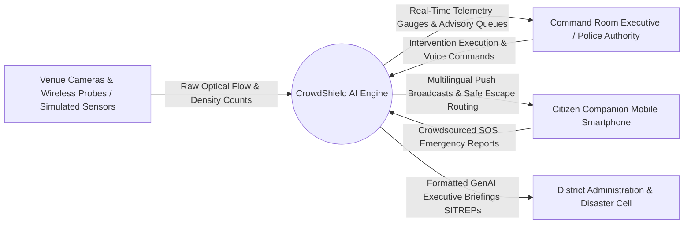
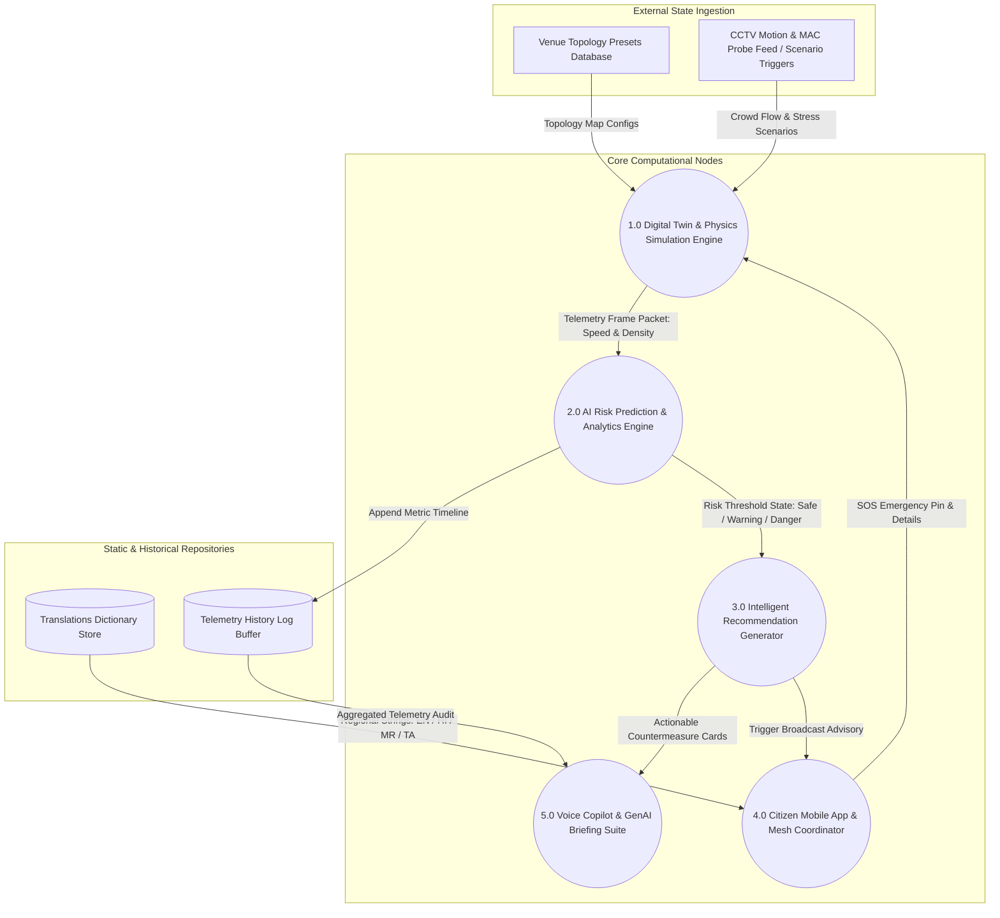
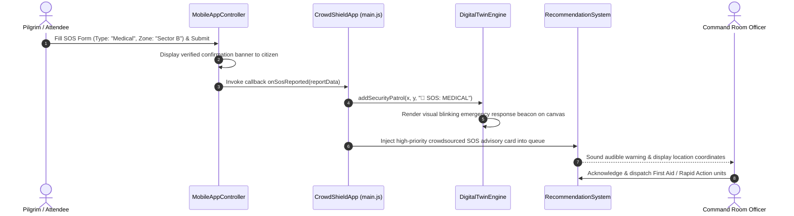

# Data Flow Diagrams (DFD) Document
**Project Name:** CrowdShield: AI-Powered Early Warning System for Preventing Crowd Stampedes  
**Document Type:** Level 0, Level 1, and Level 2 Data Flow Architecture  
**Document Version:** 1.0 (Production Release)  

---

## 1. Level 0 DFD: Context Diagram
The Level 0 Context Diagram depicts the primary external boundaries and data exchanges connecting external entities to the centralized **CrowdShield AI Platform**:



---

## 2. Level 1 DFD: Internal Module Data Pathways
The Level 1 Diagram exposes internal process boundaries, breaking the system into distinct operational calculation units and data storage dictionaries:



---

## 3. Level 2 DFD: Deep Closed-Loop Intervention & SOS Feedbacks

### 3.1 Scenario Trigger & AI Countermeasure Execution Loop
This diagram tracks data packet mutation when an executive evaluator initiates an artificial bottleneck crisis and applies automated countermeasures:

```mermaid
sequenceDiagram
    autonumber
    actor Judge as Evaluator / Authority
    participant Sim as DigitalTwinEngine
    participant Risk as RiskPredictionEngine
    participant Recs as RecommendationSystem
    participant Mobile as MobileAppController

    Judge->>Sim: Click Scenario: "🚪 Gate 2 Blockage"
    Sim->>Sim: Modify Gate 2 State to CLOSED; force particle convergence
    Sim-->>Risk: Emit Telemetry (Density: 4.9 p/m², Speed: 0.2 m/s)
    Risk->>Risk: Evaluate $d \ge 4.5$; escalate Status -> CRITICAL DANGER
    Risk->>Recs: Trigger evaluateSituation('danger', telemetry)
    Recs->>Recs: Synthesize Advisory Card: "Open Emergency Gate 4 & Divert Flow"
    Recs-->>Judge: Display high-priority action button in UI
    
    Judge->>Recs: Click Button: "⚡ Accept & Execute Advisory"
    Recs->>Sim: executeIntervention('open_emergency_exit')
    Sim->>Sim: Open Gate 4 Ramp; re-route 50% congested particles
    Recs->>Mobile: pushBroadcast('gateClosed')
    Mobile->>Mobile: Resolve regional translation & trigger push alert badge
    Sim-->>Risk: Emit Restored Telemetry (Density: 1.7 p/m², Speed: 1.4 m/s)
    Risk->>Risk: De-escalate Status -> SAFE (Green)
```

### 3.2 Crowdsourced Citizen SOS Early Warning Flow
This diagram details data travel when an on-site citizen utilizes the mobile app to report localized medical distress or panic:



---

## 4. Data Packet Dictionary

| Packet Name | Source Module | Destination Module | Payload Schema Details |
| :--- | :--- | :--- | :--- |
| **Telemetry Frame** | [digitalTwinEngine.js](file:///C:/Users/ankit/OneDrive/Documents/GitHub/crowdcatchup/src/simulation/digitalTwinEngine.js) | [riskPredictionEngine.js](file:///C:/Users/ankit/OneDrive/Documents/GitHub/crowdcatchup/src/ai/riskPredictionEngine.js) | `{ peakDensity: Number, avgSpeed: Number, stampedeLikelihood: Number, timeToIncident: String, bottlenecksCount: Number, statusLevel: String }` |
| **Advisory Specification** | [recommendationSystem.js](file:///C:/Users/ankit/OneDrive/Documents/GitHub/crowdcatchup/src/ai/recommendationSystem.js) | Command Room Dashboard | `{ id: String, title: String, priority: 'high'|'med'|'info', isCritical: Boolean, description: String, actionType: String, broadcastKey: String }` |
| **SOS Emergency Report** | [mobileAppController.js](file:///C:/Users/ankit/OneDrive/Documents/GitHub/crowdcatchup/src/modules/mobileAppController.js) | [main.js](file:///C:/Users/ankit/OneDrive/Documents/GitHub/crowdcatchup/src/main.js) | `{ type: 'overcrowding'|'medical'|'blockage'|'panic', zone: String, details: String, timestamp: Number }` |
| **Translation Lookup** | [translations.js](file:///C:/Users/ankit/OneDrive/Documents/GitHub/crowdcatchup/src/data/translations.js) | [mobileAppController.js](file:///C:/Users/ankit/OneDrive/Documents/GitHub/crowdcatchup/src/modules/mobileAppController.js) | `{ title: String, desc: String, meta: String }` |
