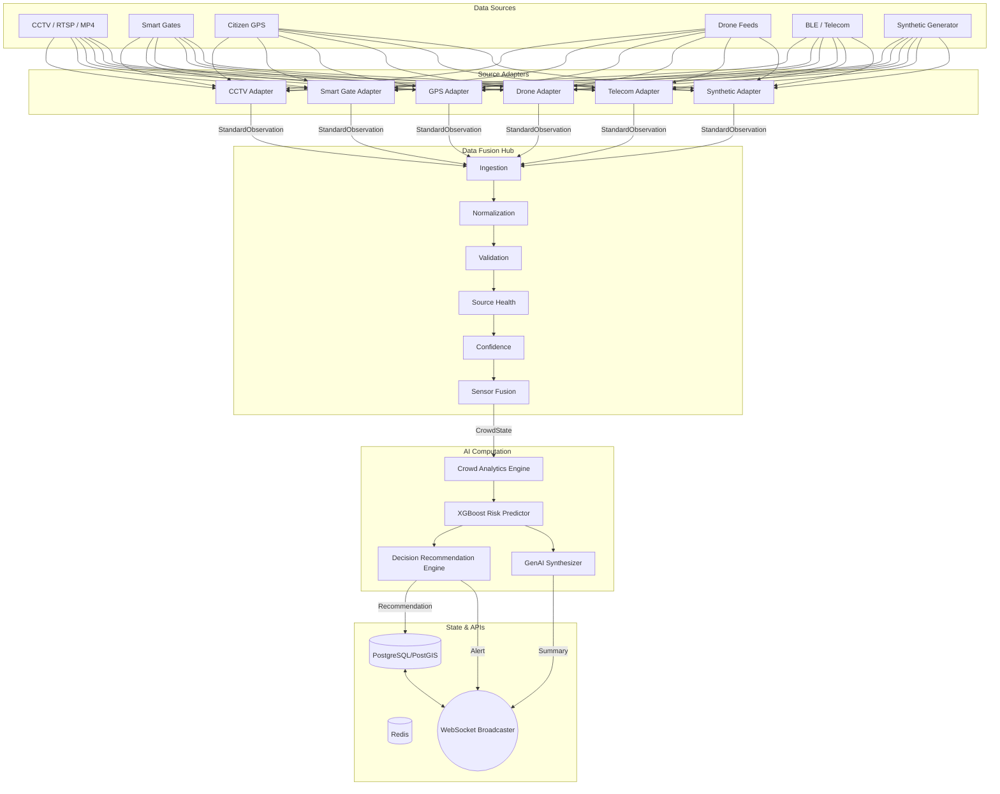

# Data Flow Diagrams (DFD) Document
**Project Name:** CrowdShield: AI-Powered Multi-Source Early Warning and Decision Support System for Large Public Events
**Document Version:** 3.0 (Multi-Source Data Fusion Architecture Release)

> **Authoritative Source:** For the complete 63-section system specification, see [`00_MASTER_SPEC.md`](./00_MASTER_SPEC.md).

---

## 1. Level 0 DFD: Context Diagram

```mermaid
graph LR
    E1[CCTV Cameras & Drones] -->|Video Streams| API((FastAPI / Data Fusion Hub))
    E2[Smart Gates] -->|Entry/Exit Counts| API
    E3[Citizen GPS] -->|Location (Opt-in)| API
    E4[Telecom/BLE] -->|Aggregated Signals| API
    E5[Synthetic/Historical] -->|Simulated Data| API

    API -->|Risk Updates & Alerts| E6[Authority PWA]
    API -->|Task Assignments| E7[Police PWA]
    API -->|Safe Routes & Warnings| E8[Citizen PWA]
    API -->|Event Config & Analytics| E9[Event Owner PWA]
    E6 -->|Approval Commands| API
    E9 -->|Event Setup| API
```

---

## 2. Level 1 DFD: Internal Module Data Pathways



---

## 3. Level 2 DFD: Multi-Source Data Flow

### 3.1 CCTV Data Flow
```
RTSP Stream / MP4 File
  → Frame Extraction (OpenCV)
  → YOLO Person Detection
  → BoT-SORT Tracking
  → Metrics: people_count, avg_speed, direction, flow_conflict
  → StandardObservation { source_type: "CCTV", metric: "people_count", ... }
  → Data Fusion Hub
```

### 3.2 Smart Gate Data Flow
```
Gate Hardware (IR/LiDAR/Turnstile/etc.)
  → Gate Adapter (HTTP/WebSocket)
  → Metrics: entry_count, exit_count, flow_rate, queue_estimate
  → StandardObservation { source_type: "SMART_GATE", metric: "entry_rate", ... }
  → Data Fusion Hub
```

### 3.3 Citizen GPS Data Flow
```
PWA Geolocation API (opt-in)
  → Location Point { lat, lng, timestamp }
  → Zone Mapping (point-in-polygon)
  → Aggregated per-zone count
  → StandardObservation { source_type: "GPS", metric: "zone_device_count", ... }
  → Data Fusion Hub
```

### 3.4 Synthetic Data Flow
```
Python Simulation Generator
  → Scenario Config (normal, surge, blockage, etc.)
  → StandardObservation (identical format to real sources)
  → Data Fusion Hub
```

---

## 4. Data Fusion Pipeline Flow

```text
SOURCE OBSERVATIONS (multiple sources, overlapping populations)
  ↓
INGESTION (accept from all adapters)
  ↓
NORMALIZATION (convert to StandardObservation)
  ↓
VALIDATION (schema + range checks)
  ↓
GEO MAPPING (map observations to zones)
  ↓
SOURCE HEALTH CHECK (is this source ONLINE/DELAYED/OFFLINE?)
  ↓
CONFIDENCE CALCULATION (accuracy × freshness × health)
  ↓
DISAGREEMENT DETECTION (do sources agree? flag anomalies)
  ↓
SENSOR FUSION (confidence-weighted estimation, NOT addition)
  ↓
CROWD STATE (unified per-zone: density, speed, flow, risk)
  ↓
RISK PREDICTION (XGBoost: 5/10/15 min forecasts)
  ↓
RECOMMENDATION (decision engine proposes interventions)
```

---

## 5. Standard Data Packet Dictionary

| Packet Name | Source | Destination | Key Fields |
| :--- | :--- | :--- | :--- |
| **StandardObservation** | Any Source | Fusion Hub | event_id, source_id, source_type, zone_id, timestamp, metric, value, confidence, health |
| **CrowdState** | Fusion Hub | Risk Engine, Frontend | event_id, zone_id, estimated_people, density_level, average_speed, flow_direction, entry_rate, exit_rate, bottleneck_score, risk_score, risk_level, confidence |
| **RiskUpdate** | Risk Engine | Authority PWA | zone_id, risk_score, risk_level, predictions (5/10/15 min), timestamp |
| **Recommendation** | Decision Engine | Authority PWA | recommendation_id, actions, explanation, confidence |
| **SecurityTask** | API | Police PWA | zone_id, distance, risk_level, instructions, required_officers |
| **CitizenAlert** | API | Citizen PWA | level, zone, message_key, recommended_gate |
| **SourceHealth** | Fusion Hub | Authority PWA | source_id, source_type, health_status, last_seen, confidence_impact |
| **SosIncident** | Citizen PWA | API | type, geo_coordinates, details, timestamp |
