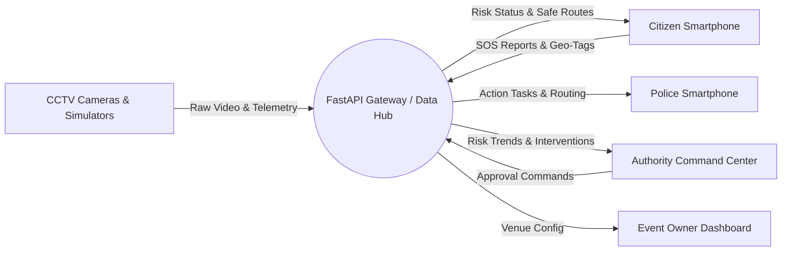
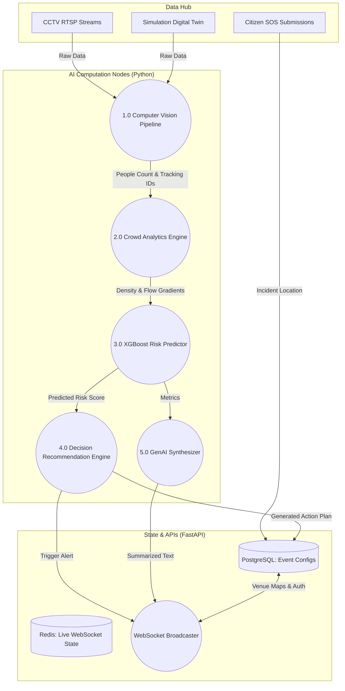
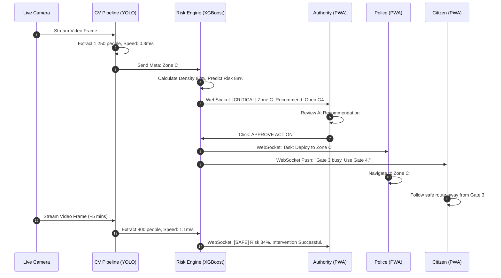

# Data Flow Diagrams (DFD) Document
**Project Name:** CrowdShield: AI-Powered Early Warning System for Preventing Crowd Stampedes  
**Document Type:** Level 0, Level 1, and Level 2 Data Flow Architecture  
**Document Version:** 2.0 (Monorepo/PWA Architecture Release)  

---

## 1. Level 0 DFD: Context Diagram
The Level 0 Context Diagram depicts the primary external boundaries and data exchanges connecting external entities to the centralized **CrowdShield Platform**:

---

## 2. Level 1 DFD: Internal Module Data Pathways
The Level 1 Diagram exposes internal process boundaries, separating Data Ingestion, AI Processing, and State Management.

---

## 3. Level 2 DFD: Deep Closed-Loop Intervention Feedback
This diagram tracks the exact data packet lifecycle when a critical incident occurs, flows through the AI, receives human approval, and alerts the public.

---

## 4. Standard Data Packet Dictionary (JSON Schema)

| Packet Name | Source | Destination | Payload Schema Details |
| :--- | :--- | :--- | :--- |
| **Ingestion Frame** | CCTV / Simulation | CV Pipeline | `{ event_id, zone_id, timestamp, people_count, density, entry_rate, exit_rate }` |
| **Risk Update** | Risk Engine | FastAPI Redis | `{ zone: String, risk_score: Float, predicted_risk: Array, status: 'SAFE'\|'WARNING'\|'CRITICAL' }` |
| **Recommendation** | Decision Engine | Authority PWA | `{ id: String, actions: [{type: "OPEN_GATE", target: "G4"}, {type: "DEPLOY", count: 6}] }` |
| **Public Alert** | FastAPI | Citizen PWA | `{ type: "AVOID_ZONE", zone: "C", recommendation: "G4", timestamp: Int }` |
