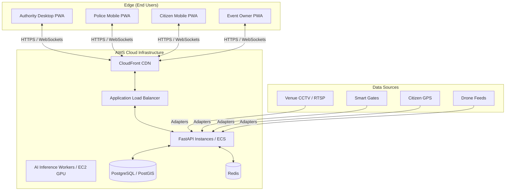

# Production Deployment & Operational Playbook (OPS)
**Project Name:** CrowdShield: AI-Powered Multi-Source Early Warning and Decision Support System for Large Public Events
**Document Version:** 3.0 (Multi-Source Data Fusion Architecture Release)

> **Authoritative Source:** For the complete 63-section system specification, see [`00_MASTER_SPEC.md`](./00_MASTER_SPEC.md).

---

## 1. Production Deployment Topology

CrowdShield utilizes a **Hybrid Cloud-to-Edge Deployment Architecture**.



### 1.1 Server Specifications
* **Frontend (Next.js):** Vercel or AWS Amplify for global edge caching.
* **Backend API (FastAPI):** AWS ECS or Render with auto-scaling.
* **AI Inference:** GPU-accelerated EC2 instances (g4dn.xlarge) for YOLOv8.
* **Database:** PostgreSQL + PostGIS for spatial queries.
* **Cache:** Redis for live state, Pub/Sub for real-time streaming.

---

## 2. Multi-Source Resilience & Graceful Degradation

### 2.1 Source Failure Handling

| Failure Scenario | System Response |
| :--- | :--- |
| CCTV stream drops | Camera marked OFFLINE. XGBoost falls back to historical data. Confidence decays over time. |
| Smart Gate goes offline | Gate marked OFFLINE. Fusion relies on CCTV + GPS for that zone. |
| GPS unavailable | System continues with CCTV + Smart Gates. GPS confidence drops to 0. |
| Drone unavailable | System continues with ground-level sources. |
| Telecom/BLE unavailable | Already simulated; adapter returns OFFLINE status. |
| Redis connection lost | In-memory fallback. WebSocket broadcast degrades. |
| PostgreSQL connection lost | Cached last-known state served. Writes buffered. |

### 2.2 Degraded Operation Modes

| Mode | Condition | Behavior |
| :--- | :--- | :--- |
| **Full Operation** | All core sources ONLINE | Complete fusion, full confidence |
| **Degraded Operation** | 1-2 core sources OFFLINE | Reduced confidence, fallback to available sources |
| **Minimal Operation** | Only 1 source available | Single-source mode, low confidence warnings |
| **Offline Mode** | No connectivity | PWA serves cached maps, last-known state, local alerts |

### 2.3 Source Health Monitoring

```text
Source Health Check Loop:
  1. Each adapter reports last_seen timestamp
  2. If last_seen > threshold: mark DELAYED
  3. If last_seen > extended_threshold: mark OFFLINE
  4. Fusion Hub adjusts confidence weights accordingly
  5. Authority dashboard shows real-time source health
```

---

## 3. PWA Offline Networking Architecture

### 3.1 Cellular Blackout Mitigation

During crowd convergences exceeding 50,000 attendees, cellular towers experience severe packet saturation.

1. **Pre-Caching:** Service Worker caches HTML shell, CSS, JS, and venue map tiles.
2. **IndexedDB State:** Safe routes and emergency protocols cached in browser.
3. **Offline Mode:** Map remains interactive. "No Connection" toast displayed.
4. **Re-sync:** Background sync attempts. On reconnect, pulls latest risk payload.

### 3.2 Low-Bandwidth Fallback

Compact JSON tuples for emergency broadcasts:
```json
{"id":"em_8041","k":"emergencyEvac","g":"Gate 5","t":1754418652000,"p":1}
```

---

## 4. Reliability & Fallback Protocols

### 4.1 False Alarm Suppression
* **No Auto-Triggering:** AI never automatically broadcasts alerts to citizens.
* **Validation:** All critical recommendations must be manually approved by Authority.
* **Explainable:** Every recommendation includes reasoning.

### 4.2 Camera Failure Protocol
* Data Hub marks camera as DISCONNECTED.
* XGBoost falls back to historical time-series data.
* Confidence decays over time.
* If camera down > 5 minutes, Authority alerted to deploy manual verification.

---

## 5. CI/CD & Deployment Pipeline

1. **GitHub Actions:** Triggered on merge to `main`.
2. **Matrix Build:** pytest on `/apps/api`, playwright on `/apps/web`.
3. **Containerization:** Docker images for FastAPI and AI workers.
4. **Deployment:** Push to AWS ECR, update ECS cluster. Vercel auto-deploys Next.js.

---

## 6. Event Isolation in Deployment

Every observation must contain an event identifier. The deployment must enforce:
* Database queries are scoped by event_id.
* WebSocket channels are separated by event.
* API endpoints validate event context.
* Never mix Event A data with Event B.
