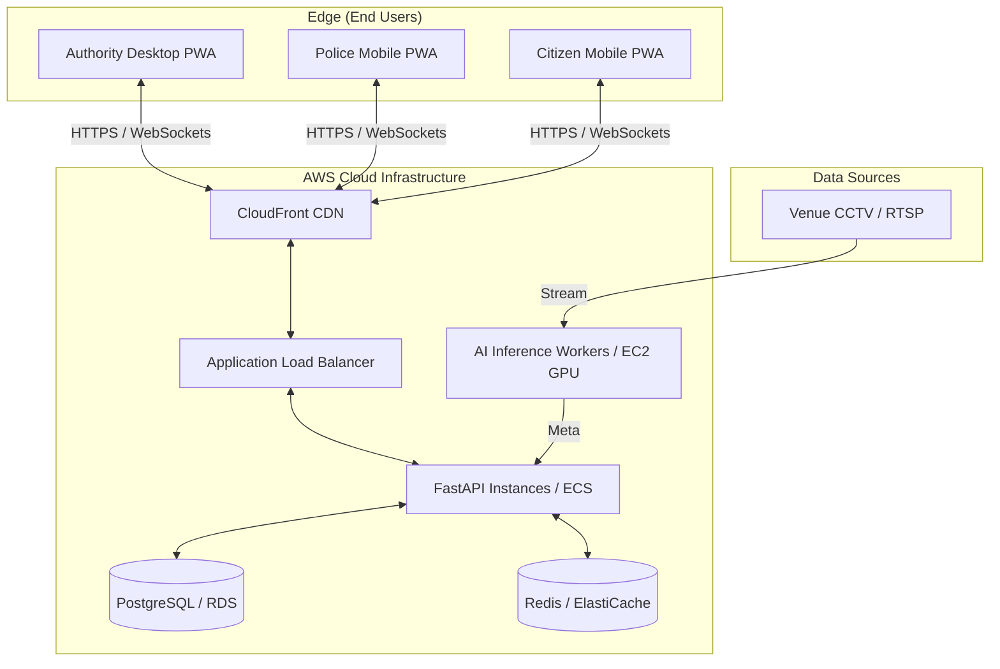

# Production Deployment & Operational Playbook (OPS)
**Project Name:** CrowdShield: AI-Powered Early Warning System for Preventing Crowd Stampedes  
**Document Type:** Cloud/Edge Deployment Architecture & Offline PWA Specification  
**Document Version:** 2.0 (Monorepo/PWA Architecture Release)  

---

## 1. Production Deployment Topology

CrowdShield utilizes a **Hybrid Cloud-to-Edge Deployment Architecture**. The heavy AI calculations are centralized on the backend (FastAPI + GPU compute), while the frontend is distributed as a lightweight Next.js Progressive Web App (PWA) to citizens and authorities.

### 1.1 Server Specifications
* **Frontend (Next.js):** Deployed via Vercel or AWS Amplify for global edge caching of static assets.
* **Backend API (FastAPI):** Deployed on AWS ECS (Elastic Container Service) with auto-scaling based on active WebSocket connections.
* **AI Inference:** Deployed on GPU-accelerated EC2 instances (e.g., `g4dn.xlarge`) to run YOLO and BoT-SORT object tracking at 30+ FPS.
* **Database:** AWS RDS PostgreSQL with PostGIS enabled for spatial queries.

---

## 2. PWA Offline Networking Architecture

### 2.1 Cellular Blackout Mitigation (Service Workers)
During crowd convergences exceeding $50,000$ attendees, cellular towers experience severe packet saturation. 

CrowdShield mitigates this by functioning as an **Offline-First PWA**:
1. **Pre-Caching:** When a citizen installs the CrowdShield PWA before arriving at the venue, the Service Worker (`sw.js`) caches the HTML shell, CSS, JavaScript, and the vector map tiles of the venue.
2. **IndexedDB State:** The application downloads the structural safe routes and emergency protocols into the browser's IndexedDB.
3. **Offline Mode:** If the connection drops to `0kbps`, the app immediately transitions to Offline Mode. The map remains fully interactive. 
4. **Re-sync:** The app continues attempting background syncs. The moment a user catches a weak Wi-Fi or cellular signal, the PWA pulls the latest 256-byte JSON risk payload and updates the map.

---

## 3. Reliability & Fallback Protocols (Disaster Recovery)

### 3.1 Sensor Degradation & Camera Failure
If an incoming CCTV optical stream drops offline:
* The Data Hub marks the camera as `DISCONNECTED`.
* The XGBoost Risk Model automatically falls back to predicting based on historical time-series data for that specific zone, decaying its confidence score over time.
* If a camera is down for > 5 minutes, an alert is pushed to the Authority dashboard to manually deploy Police to establish visual confirmation.

### 3.2 False Alarm Suppression (Human-in-the-Loop)
To prevent warning-induced panic:
* **No Auto-Triggering:** AI never automatically broadcasts alerts to citizens. 
* **Validation:** All critical AI recommendations (e.g., "Open Gate 4") must be manually clicked and approved by the Authority role.
* Once `APPROVED`, the FastAPI backend executes the push notifications to the Citizen and Police PWAs simultaneously via WebSockets.

---

## 4. CI/CD & Deployment Pipeline
Because CrowdShield is a Monorepo, the deployment pipeline is highly structured:
1. **GitHub Actions:** Triggered on merge to `main`.
2. **Matrix Build:** 
   * Runs `pytest` on `/apps/api`
   * Runs `playwright` E2E tests on `/apps/web`
3. **Containerization:** Builds Docker images for FastAPI and AI workers.
4. **Deployment:** Pushes images to AWS ECR and updates the ECS cluster. Vercel automatically deploys the Next.js `/apps/web` application.
